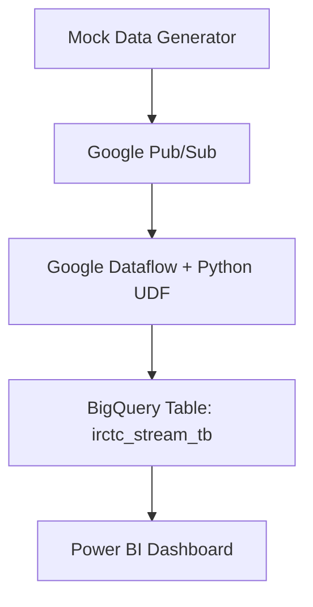

# 🚄 irctc-gcp-bigquery-pipeline

Simulated IRCTC data pipeline using Python, Google Pub/Sub, Dataflow, and BigQuery. Auto-transformation with a custom Python UDF and a live Power BI dashboard built on BigQuery warehouse.

---

## 🖼️ Gallery – Quick Preview

**BigQuery Table Preview**  


**Pipeline Architecture Diagram**  


**Cloud Storage Bucket**  


**Dataflow Job Summary**  


**Dataflow Output Tables**  


**Pub/Sub Topic**  


---

## 🛠️ Project Overview

This project simulates IRCTC-like streaming data, transforms it on the fly using Google Dataflow with a Python UDF, and ingests it into BigQuery for analysis. Power BI connects to BigQuery to provide real-time insights on user behavior, activity trends, and loyalty segmentation.

---

## 🧰 Tech Stack

- **Python** – Mock data generation & transformation logic
- **Google Pub/Sub** – Stream ingestion
- **Google Cloud Dataflow** – Data processing with UDF
- **Google BigQuery** – Data warehouse
- **Google Cloud Storage** – UDF staging
- **Power BI** – Dashboard visualization

---

## 📡 Architecture



---

## 🔧 Setup Steps

### 1. Create Pub/Sub Topic and Subscription

```bash
gcloud pubsub topics create mock-data-topic
gcloud pubsub subscriptions create mock-data-sub --topic=mock-data-topic
```

---

### 2. Upload UDF to GCS

```bash
gsutil cp transform_udf.py gs://your-bucket-name/scripts/transform_udf.py
```

Sample `transform_udf.py`:

```python
def transform(element):
    import json
    data = json.loads(element)
    data['processed'] = True
    return json.dumps(data)
```

---

### 3. Python Mock Data Publisher

```python
from google.cloud import pubsub_v1
import json, time, random

publisher = pubsub_v1.PublisherClient()
topic_path = publisher.topic_path("your-project-id", "mock-data-topic")

def generate_mock_data():
    return {
        "user_id": random.randint(1, 100),
        "event_type": random.choice(["click", "view", "purchase"]),
        "timestamp": time.time()
    }

while True:
    data = json.dumps(generate_mock_data()).encode("utf-8")
    publisher.publish(topic_path, data=data)
    print("Published:", data)
    time.sleep(2)
```

---

### 4. Dataflow Python Pipeline (Apache Beam)

```python
import apache_beam as beam
from apache_beam.options.pipeline_options import PipelineOptions

class ParseMessageFn(beam.DoFn):
    def process(self, element):
        import json
        yield json.loads(element.decode('utf-8'))

options = PipelineOptions(
    streaming=True,
    project='your-project-id',
    runner='DataflowRunner',
    temp_location='gs://your-bucket/tmp',
    region='us-central1'
)

with beam.Pipeline(options=options) as p:
    (
        p
        | 'Read from PubSub' >> beam.io.ReadFromPubSub(topic='projects/your-project-id/topics/mock-data-topic')
        | 'Parse JSON' >> beam.ParDo(ParseMessageFn())
        | 'Write to BigQuery' >> beam.io.WriteToBigQuery(
            'your-dataset.your_table',
            schema='user_id:INTEGER,event_type:STRING,timestamp:FLOAT,processed:BOOLEAN',
            write_disposition=beam.io.BigQueryDisposition.WRITE_APPEND
        )
    )
```

---

### 5. BigQuery Table Schema

```sql
CREATE TABLE your_dataset.your_table (
    user_id INT64,
    event_type STRING,
    timestamp FLOAT64,
    processed BOOL
);
```

---

### 6. Power BI Setup

- Connect Power BI to BigQuery.
- Load table `your_dataset.your_table`.
- Create visuals: bar chart for `event_type`, line chart for event volume over `timestamp`.

---

## ✅ Validation

```bash
bq query --nouse_legacy_sql 'SELECT COUNT(*) FROM your_dataset.your_table'
bq query --nouse_legacy_sql 'SELECT * FROM your_dataset.your_table ORDER BY timestamp DESC LIMIT 10'
```

---

## 💡 Notes

- Ensure proper IAM roles are assigned (Pub/Sub Publisher, BigQuery Admin, Dataflow Admin).
- For production, move credentials to Secret Manager.
- Logging can be added with `logging` module inside transformation steps.
